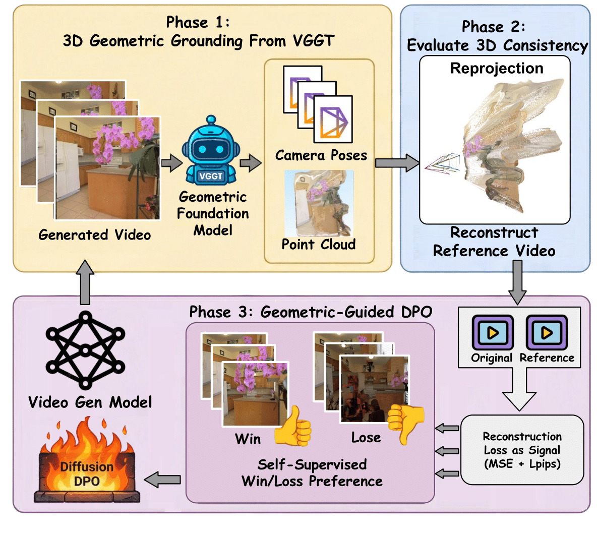

<div align="center">

# VideoGPA: Distilling Geometry Priors for 3D-Consistent Video Generation

[**Hongyang Du**](https://hongyang-du.github.io/)<sup>*1,2</sup>  · [**Junjie Ye**](https://junjieye.com/)<sup>*1</sup>· [**Xiaoyan Cong**](https://oliver-cong02.github.io/)<sup>*2</sup> · **Runhao Li**<sup>1</sup> · [**Jingcheng Ni**](https://jingchengni.com/)<sup>2</sup>  
**Aman Agarwal**<sup>2</sup>  · **Zeqi Zhou**<sup>2</sup> · [**Zekun Li**](https://kunkun0w0.github.io/)<sup>2</sup>  · [**Randall Balestriero**](https://randallbalestriero.github.io/)<sup>2</sup> · [**Yue Wang**](https://yuewang.xyz/)<sup>1</sup>

<sup>1</sup>Physical SuperIntelligence Lab, University of Southern California 
<br> 
<sup>2</sup>Department of Computer Science, Brown University 
<br>
<sup>*</sup> Equal Contribution

<a href=''></a>
<a href='https://hongyang-du.github.io/VideoGPA-Website/'></a>
[](https://opensource.org/licenses/MIT)

</div>


VideoGPA leverages a 3D Geometric Foundation Model to perform scene-level reconstruction, effectively aligning video diffusion models via Direct Preference Optimization (DPO) to achieve superior 3D consistency.


# Quick Inference Scripts 🚀

This directory contains simplified command-line scripts for generating videos using **CogVideoX** models. These scripts are designed for quick testing and allow you to run inference directly from the terminal without preparing complex JSON configuration files.

Both scripts support loading **LoRA adapters** for customized generation.

## 📋 Requirements

Please make sure your Python version is between 3.10 and 3.12, inclusive of both 3.10 and 3.12.

```bash
pip install -r requirements.txt
```
## 🔘 Checkpoint Download 

### Automatic Download (Recommended)
#### Method 1: Using the Download Script
Run the provided Python script to download checkpoint files:
```bash
# Download all checkpoints
python download_ckpt.py all

# Or download specific checkpoints
python download_ckpt.py i2v    # CogVideoX-I2V-5B
python download_ckpt.py t2v    # CogVideoX-5B
python download_ckpt.py t2v15  # CogVideoX1.5-5B
```

The script will:
- ✅ Check if files already exist (skip re-downloading)
- 🚀 Download missing checkpoints with progress bars
- 📁 Organize files into the correct directory structure

### Expected Directory Structure
After successful download, your checkpoints folder should look like:
```
checkpoints/
├── VideoGPA-I2V-lora/
│   └── adapter_model.safetensors
├── VideoGPA-T2V-lora/
│   └── adapter_model.safetensors
└── VideoGPA-T2V1.5-lora/
    └── adapter_model.safetensors
```

## 📝 Available Scripts

### 1. Text-to-Video Generation ([t2v_inference.py](generate/t2v_inference.py))

Generate videos from text prompts using CogVideoX-5B.

**Basic Usage:**
```bash
cd generate
python t2v_inference.py "A cat playing with a ball in a garden"
```

**Advanced Usage:**
```bash
python t2v_inference.py "A flying drone over a city skyline at sunset" \
    --output_dir ./my_videos \
    --lora_path ./checkpoints/my_lora_adapter \
    --gpu_id 0
```

**Arguments:**
- `prompt` (required): Text prompt for video generation
- `--output_dir`: Directory to save generated videos (default: `./outputs`)
- `--lora_path`: Path to LoRA adapter weights (optional)
- `--gpu_id`: GPU device ID (default: 0)

**Output:** Videos saved as `{prompt}_seed{seed}.mp4`

---

### 2. Image-to-Video Generation ([i2v_inference.py](generate/i2v_inference.py))

Generate videos from a static image with text guidance using CogVideoX-5B-I2V.

**Basic Usage:**
```bash
cd generate
python i2v_inference.py "The camera slowly zooms in" ./path/to/image.jpg
```

**Advanced Usage:**
```bash
python i2v_inference.py "A realistic continuation of the reference scene. Everything must remain completely static: no moving people, no shifting objects, and no dynamic elements. Only the camera is allowed to move. Render physically accurate multi-step camera motion.  Camera motion: roll gently to one side, then swing around the room, followed by push forward into the scene." ./image.png \
    --output_dir ./i2v_outputs \
    --lora_path ./checkpoints/i2v_lora \
    --gpu_id 1
```

**Arguments:**
- `prompt` (required): Text prompt describing motion/scene
- `image_path` (required): Path to input image file
- `--output_dir`: Directory to save generated videos (default: `./outputs`)
- `--lora_path`: Path to LoRA adapter weights (optional)
- `--gpu_id`: GPU device ID (default: 0)

**Output:** Videos saved as `{image_name}_seed{seed}.mp4`

---

## ⚙️ Configuration

Both scripts include configurable generation parameters:

```python
NUM_INFERENCE_STEPS = 50  # Number of diffusion steps
GUIDANCE_SCALE = 6.0      # Classifier-free guidance scale
SEED = 42              # Seed for generation
```


## 💾 GPU Memory Requirements

- **Minimum VRAM**: diffusers BF16 ~5GB for base models 
- Memory optimizations (VAE tiling/slicing) are automatically enabled

## 🚀 Features

- **Video Quality Assessment**: Comprehensive metrics for evaluating video generation quality
- **DPO Training**: Direct Preference Optimization for video generation models
- **Multi-Model Support**: Compatible with CogVideoX and other video generation models
- **Flexible Pipeline**: Easy-to-use inference and training pipelines

## 📁 Code Structure

```
VideoGPA/
├── data_prep/      # Data preparation scripts
├── train_dpo/      # DPO training scripts
├── pipelines/      # Inference pipelines
├── metrics/        # Quality assessment metrics
├── vggt/           # Video generation model architecture
└── utils/          # Utility functions
```


## 🔧 DPO Training (Direct Preference Optimization) 

VideoGPA leverages DPO to optimize video generation quality through preference learning. The training pipeline consists of 3 steps after you have your generated videos. Revise the configs as you need:

#### Step 1: Score Your Generate Videos
```bash
python train_dpo/video_scorer.py
```

#### Step 2: Encode Videos to Latent Space
```bash
# For Text-to-Video models
python train_dpo/CogVideoX-T2V-5B_lora/02_encode.py

# For Image-to-Video models
python train_dpo/CogVideoX-I2V-5B_lora/02_encode.py
```

#### Step 3: Run DPO Training
```bash
# Text-to-Video DPO training
python train_dpo/CogVideoX-T2V-5B_lora/03_train.py

# Image-to-Video DPO training
python train_dpo/CogVideoX-I2V-5B_lora/03_train.py
```

**Key Features:**
- 🎯 Preference-based learning using winner/loser pairs
- 🔧 Parameter-efficient fine-tuning with LoRA
- 📊 Multiple quality metrics support
- ⚡ Distributed training with PyTorch Lightning
- 💾 Automatic gradient checkpointing and memory optimization

**Data Format:** Training requires JSON metadata containing preference pairs - multiple videos generated from the same prompt with quality scores. See [dataset.py](train_dpo/dataset.py) for details.


## 🙏 Acknowledgements

We would like to express our gratitude to the following projects and researchers:

* **[CogVideoX](https://github.com/zai-org/CogVideo)** - The foundational state-of-the-art video generation model.
* **[PEFT](https://github.com/huggingface/peft)** - For enabling efficient fine-tuning with LoRA and other parameter-efficient methods.
* **[Diffusion DPO](https://github.com/SalesforceAIResearch/DiffusionDPO)** - For the innovative Direct Preference Optimization approach in the diffusion latent space.

## 🌟 Citation
If you find our work helpful, please leave us a star and cite our paper.

