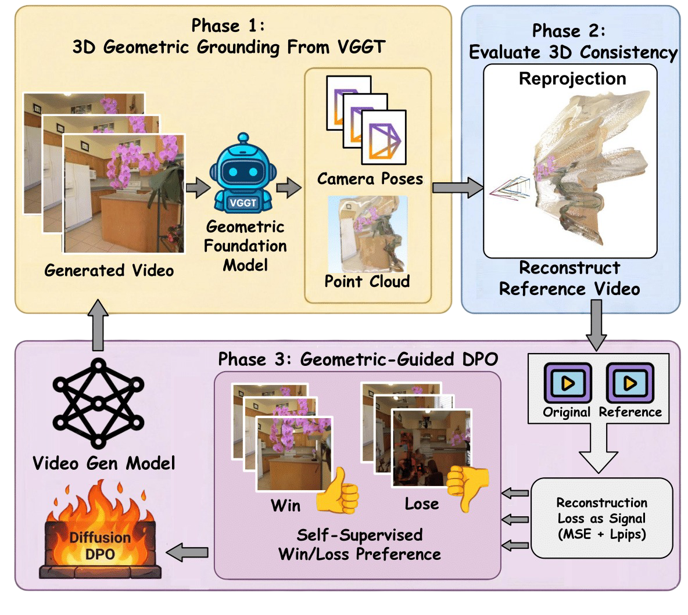

<div align="center">

# VideoGPA: Distilling Geometry Priors for 3D-Consistent Video Generation [Under Construction]

[**Hongyang Du**](https://hongyang-du.github.io/)<sup>*1,2</sup>  · [**Junjie Ye**](https://junjieye.com/)<sup>*1</sup>· [**Xiaoyan Cong**](https://oliver-cong02.github.io/)<sup>*2</sup> · **Runhao Li**<sup>1</sup> · [**Jingcheng Ni**](https://jingchengni.com/)<sup>2</sup>  
[**Aman Agarwal**](https://aman190202.github.io)<sup>2</sup>  · **Zeqi Zhou**<sup>2</sup> · [**Zekun Li**](https://kunkun0w0.github.io/)<sup>2</sup>  · [**Randall Balestriero**](https://randallbalestriero.github.io/)<sup>2</sup> · [**Yue Wang**](https://yuewang.xyz/)<sup>1</sup>

<sup>1</sup>Physical SuperIntelligence Lab, University of Southern California 
<br> 
<sup>2</sup>Department of Computer Science, Brown University 
<br>
<sup>*</sup> Equal Contribution

<a href='https://arxiv.org/abs/2601.23286'></a>
<a href='https://hongyang-du.github.io/VideoGPA-Website/'></a>
[](https://opensource.org/licenses/MIT)

</div>

<div align="center">
  
</div>


# Quick Start

## 📋 Requirements

Python 3.10 – 3.12.

```bash
pip install -r requirements.txt
```

## 🔘 Checkpoint Download

```bash
# Download all VideoGPA LoRA checkpoints
python download_ckpt.py all

# Or download specific ones
python download_ckpt.py i2v    # CogVideoX-I2V-5B
python download_ckpt.py t2v    # CogVideoX-5B
python download_ckpt.py t2v15  # CogVideoX1.5-5B
```

```
checkpoints/
├── VideoGPA-I2V-lora/
│   └── adapter_model.safetensors
├── VideoGPA-T2V-lora/
│   └── adapter_model.safetensors
└── VideoGPA-T2V1.5-lora/
    └── adapter_model.safetensors
```

## 🎬 Video Generation

All scripts share the same interface: `--prompt_json` (required), `--output_dir` (required), `--lora_path` (optional for DPO), `--gpu_id`, `--seed`.

### CogVideoX-5B Text-to-Video

```bash
# Baseline (no LoRA)
python generate/CogVideoX-5B.py \
    --prompt_json prompts.json \
    --output_dir outputs/t2v_baseline

# With VideoGPA DPO LoRA
python generate/CogVideoX-5B.py \
    --prompt_json prompts.json \
    --output_dir outputs/t2v_dpo \
    --lora_path checkpoints/VideoGPA-T2V-lora
```

### CogVideoX-5B Image-to-Video

```bash
# Baseline
python generate/CogVideoX-5B-I2V.py \
    --prompt_json prompts.json \
    --output_dir outputs/i2v_baseline

# With VideoGPA DPO LoRA
python generate/CogVideoX-5B-I2V.py \
    --prompt_json prompts.json \
    --output_dir outputs/i2v_dpo \
    --lora_path checkpoints/VideoGPA-I2V-lora
```

### CogVideoX1.5-5B Text-to-Video

```bash
# Baseline
python generate/CogVideoX1.5-5B.py \
    --prompt_json prompts.json \
    --output_dir outputs/t2v15_baseline

# With VideoGPA DPO LoRA
python generate/CogVideoX1.5-5B.py \
    --prompt_json prompts.json \
    --output_dir outputs/t2v15_dpo \
    --lora_path checkpoints/VideoGPA-T2V1.5-lora
```

### Wan2.2 TI2V-5B (Text+Image-to-Video)

```bash
# Baseline
python generate/Wan2.2-TI2V-5B.py \
    --model_path /path/to/Wan2.2-TI2V-5B \
    --prompt_json prompts.json \
    --output_dir outputs/wan_baseline

# With LoRA (when available)
python generate/Wan2.2-TI2V-5B.py \
    --model_path /path/to/Wan2.2-TI2V-5B \
    --prompt_json prompts.json \
    --output_dir outputs/wan_dpo \
    --lora_path path/to/wan_lora
```

### Common Arguments

| Argument | Description | Default |
|----------|-------------|---------|
| `--prompt_json` | JSON file with prompts (required) | — |
| `--output_dir` | Output directory (required) | — |
| `--lora_path` | Path to LoRA adapter (optional) | `None` |
| `--gpu_id` | GPU device ID | `0` |
| `--seed` | Random seed | `42` |
| `--num_prompts` | Limit number of prompts | all |

### Prompt JSON Format

Scripts accept both dict and list formats:

```json
// Dict format (I2V with images)
{
  "scene_001": {"text_prompt": "Camera pans left", "image_prompt": "/path/to/img.png"},
  "scene_002": {"text_prompt": "Zoom into the building", "image_prompt": "/path/to/img2.png"}
}

// List format (T2V)
[
  {"group_id": "sample_0", "text_prompt": "A cat playing in a garden"},
  {"group_id": "sample_1", "text_prompt": "Drone flying over a city"}
]
```

## 📁 Code Structure

```
VideoGPA/
├── generate/                   # Video generation scripts
│   ├── CogVideoX-5B.py            # T2V generation
│   ├── CogVideoX-5B-I2V.py        # I2V generation
│   ├── CogVideoX1.5-5B.py         # T2V 1.5 generation
│   └── Wan2.2-TI2V-5B.py          # Wan TI2V generation
├── train/                      # DPO training pipeline
│   ├── 01_preference_pair.py       # Video scoring (shared)
│   ├── dataset.py                  # DPO dataset (shared, CogVideo + Wan)
│   ├── loss.py                     # DPO loss (shared)
│   ├── CogVideoX-5B/              # CogVideoX-5B encode & train
│   ├── CogVideoX-I2V-5B/          # CogVideoX-I2V encode & train
│   ├── CogVideoX1.5-5B/           # CogVideoX1.5-5B encode & train
│   └── Wan2.2-TI2V-5B/            # Wan2.2 TI2V encode & train
├── checkpoints/                # VideoGPA LoRA weights
├── pipelines/                  # Shared processing pipelines
├── metrics/                    # Quality assessment metrics
└── utils/                      # Utility functions
```

## 🔧 DPO Training

VideoGPA uses DPO (Direct Preference Optimization) to improve 3D consistency in video generation. The training pipeline has 3 steps:

#### Step 1: Score Generated Videos
```bash
python train/01_preference_pair.py
```

#### Step 2: Encode Videos to Latent Space
```bash
# CogVideoX models
python train/CogVideoX-I2V-5B/02_encode.py
python train/CogVideoX-5B/02_encode.py
python train/CogVideoX1.5-5B/02_encode.py

# Wan2.2 (requires --base_path and --model_path)
python train/Wan2.2-TI2V-5B/02_encode.py \
    --base_path /path/to/dataset \
    --model_path /path/to/Wan2.2-TI2V-5B \
    --input_json /path/to/scored.json \
    --output_json /path/to/encoded.json
```

#### Step 3: Run DPO Training
```bash
# CogVideoX models
python train/CogVideoX-I2V-5B/03_train.py --base_path /path/to/dataset
python train/CogVideoX-5B/03_train.py --base_path /path/to/dataset
python train/CogVideoX1.5-5B/03_train.py --base_path /path/to/dataset

# Wan2.2
python train/Wan2.2-TI2V-5B/03_train.py \
    --base_path /path/to/dataset \
    --model_path /path/to/Wan2.2-TI2V-5B
```

**Shared components** (`train/dataset.py`, `train/loss.py`) work across all models — CogVideoX uses v-prediction, Wan uses flow matching, but the DPO loss operates on model-agnostic (prediction, target) pairs.

**Data Format:** Training requires JSON metadata with preference pairs. See [dataset.py](train/dataset.py) for the expected format.


## 🙏 Acknowledgements

We would like to express our gratitude to the following projects and researchers:

* **[CogVideoX](https://github.com/zai-org/CogVideo)** - State-of-the-art video generation model.
* **[Wan2.2](https://github.com/Wan-Video/Wan2.2)** - Text/Image-to-video generation model.
* **[PEFT](https://github.com/huggingface/peft)** - Parameter-efficient fine-tuning with LoRA.
* **[Diffusion DPO](https://github.com/SalesforceAIResearch/DiffusionDPO)** - Direct Preference Optimization in the diffusion latent space.

Thanks to **[Dawei Liu](https://github.com/davidliuk)** for the amazing website design!
## 🌟 Citation

```bibtex
@misc{du2026videogpadistillinggeometrypriors,
      title={VideoGPA: Distilling Geometry Priors for 3D-Consistent Video Generation}, 
      author={Hongyang Du and Junjie Ye and Xiaoyan Cong and Runhao Li and Jingcheng Ni and Aman Agarwal and Zeqi Zhou and Zekun Li and Randall Balestriero and Yue Wang},
      year={2026},
      eprint={2601.23286},
      archivePrefix={arXiv},
      primaryClass={cs.CV},
      url={https://arxiv.org/abs/2601.23286}, 
}
```
